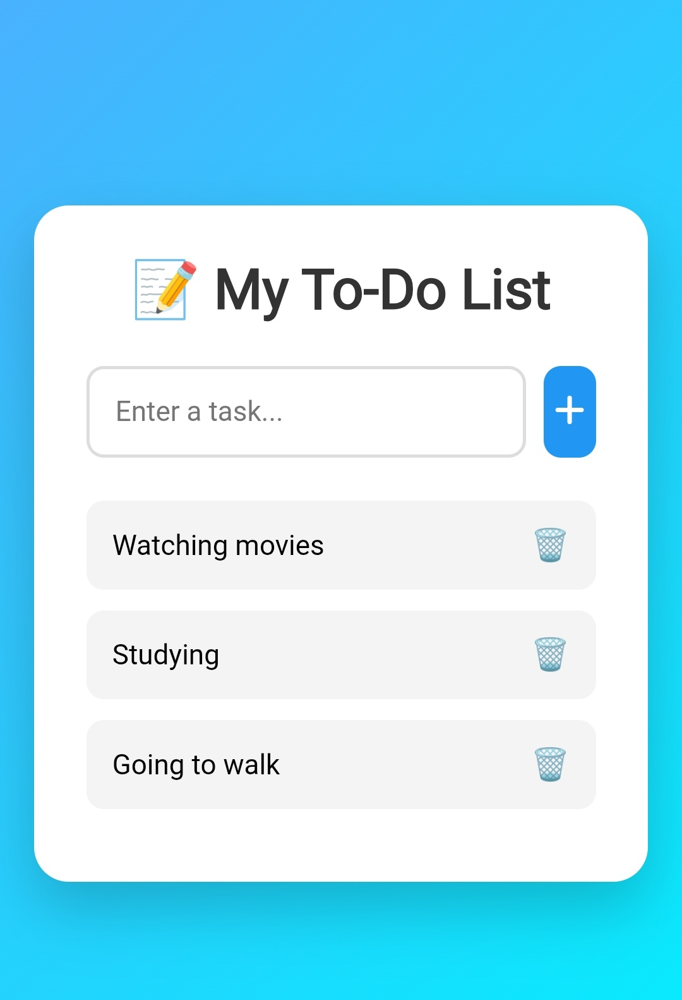

# 📝 Todo App

A clean and responsive Todo App built using HTML, CSS, and JavaScript. It allows users to add, complete, and delete daily tasks with an easy-to-use interface.

---

## ✨ Features

- ➕ Add new tasks
- ✅ Mark tasks as completed
- 🗑️ Delete tasks
- 📱 Responsive design
- ⚡ Fast and lightweight

---

## 🛠 Technologies Used

- HTML5
- CSS3
- JavaScript

---

## 📸 Screenshot



---

## 🌐 Live Demo

https://sushantsonawanex1-ui.github.io/todo-app/

---

## 📂 Repository

https://github.com/sushantsonawanex1-ui/todo-app

---

## 📁 Project Structure

```
todo-app/
│── index.html
│── style.css
│── script.js
│── todo.png
│── README.md
```

---

## 🎯 What I Learned

While building this project, I learned:

- HTML page structure
- CSS layouts
- JavaScript DOM manipulation
- Event handling
- Local project deployment using GitHub Pages

---

## 👨‍💻 Author

**Sushant Sonawane**

GitHub:
https://github.com/sushantsonawanex1-ui
